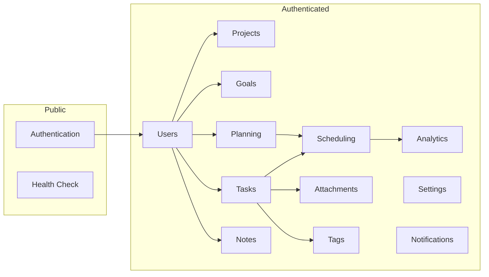

# Aether — API Design

## Overview

All API endpoints are served under the `/api/v1` prefix. Every request and response uses JSON. Authentication is required for all endpoints unless explicitly marked as public.

### Base URL

```
http://localhost:3001/api/v1
```

### Authentication

Authenticated endpoints require a `Bearer` token in the `Authorization` header:

```
Authorization: Bearer <jwt_token>
```

### Response Envelope

All responses follow a consistent envelope format documented in [architecture.md](./architecture.md).

---

## Module Map



---

## Health

### GET /api/v1/health

**Purpose:** Verify the server is running and the database is reachable.

**Auth:** Not required.

**Response 200:**
```json
{
  "success": true,
  "data": {
    "status": "healthy",
    "version": "0.2.0",
    "uptime": 3600,
    "database": "connected"
  }
}
```

---

## Authentication

### POST /api/v1/auth/github

**Purpose:** Initiate GitHub OAuth authentication. Exchanges a GitHub authorization code for an Aether JWT.

**Auth:** Not required.

**Request Body:**
```json
{
  "code": "github_authorization_code"
}
```

**Response 200:**
```json
{
  "success": true,
  "data": {
    "token": "jwt_token_string",
    "user": {
      "id": "uuid",
      "email": "user@example.com",
      "name": "User Name",
      "avatarUrl": "https://...",
      "createdAt": "2026-01-01T00:00:00Z"
    }
  }
}
```

**Error 401:**
```json
{
  "success": false,
  "error": {
    "code": "INVALID_AUTH_CODE",
    "message": "The provided authorization code is invalid or expired."
  }
}
```

### POST /api/v1/auth/refresh

**Purpose:** Refresh an expired JWT token using a refresh token.

**Auth:** Not required (uses refresh token in body).

**Request Body:**
```json
{
  "refreshToken": "refresh_token_string"
}
```

**Response 200:**
```json
{
  "success": true,
  "data": {
    "token": "new_jwt_token",
    "refreshToken": "new_refresh_token"
  }
}
```

### POST /api/v1/auth/logout

**Purpose:** Invalidate the current session.

**Auth:** Required.

**Response 200:**
```json
{
  "success": true,
  "data": {
    "message": "Logged out successfully."
  }
}
```

---

## Users

### GET /api/v1/users/me

**Purpose:** Get the authenticated user's profile.

**Auth:** Required.

**Response 200:**
```json
{
  "success": true,
  "data": {
    "id": "uuid",
    "email": "user@example.com",
    "name": "User Name",
    "avatarUrl": "https://...",
    "lastLoginAt": "2026-06-26T10:00:00Z",
    "createdAt": "2026-01-01T00:00:00Z"
  }
}
```

### PATCH /api/v1/users/me

**Purpose:** Update the authenticated user's profile.

**Auth:** Required.

**Request Body:**
```json
{
  "name": "Updated Name",
  "avatarUrl": "https://new-avatar.com/img.png"
}
```

**Response 200:** Returns the updated user object.

### DELETE /api/v1/users/me

**Purpose:** Delete the authenticated user's account and all associated data.

**Auth:** Required.

**Response 200:**
```json
{
  "success": true,
  "data": {
    "message": "Account deleted successfully."
  }
}
```

---

## Projects

### GET /api/v1/projects

**Purpose:** List all projects for the authenticated user.

**Auth:** Required.

**Query Parameters:**
| Param | Type | Default | Description |
|---|---|---|---|
| status | string | — | Filter by status (ACTIVE, PAUSED, COMPLETED, ARCHIVED) |
| page | int | 1 | Page number |
| pageSize | int | 20 | Items per page (max 100) |
| sortBy | string | sortOrder | Field to sort by |
| sortOrder | string | asc | asc or desc |

**Response 200:**
```json
{
  "success": true,
  "data": [
    {
      "id": "uuid",
      "name": "Project Name",
      "description": "Description",
      "color": "#6366f1",
      "icon": "folder",
      "status": "ACTIVE",
      "sortOrder": 0,
      "goalCount": 3,
      "taskCount": 12,
      "completedTaskCount": 5,
      "createdAt": "2026-01-01T00:00:00Z",
      "updatedAt": "2026-01-01T00:00:00Z"
    }
  ],
  "pagination": {
    "page": 1,
    "pageSize": 20,
    "totalItems": 5,
    "totalPages": 1
  }
}
```

### POST /api/v1/projects

**Purpose:** Create a new project.

**Auth:** Required.

**Request Body:**
```json
{
  "name": "Project Name",
  "description": "Optional description",
  "color": "#6366f1",
  "icon": "folder"
}
```

**Response 201:** Returns the created project.

**Error 400:**
```json
{
  "success": false,
  "error": {
    "code": "VALIDATION_ERROR",
    "message": "Validation failed.",
    "details": [
      { "field": "name", "message": "Project name is required." }
    ]
  }
}
```

### GET /api/v1/projects/:id

**Purpose:** Get a single project by ID.

**Auth:** Required. User must own the project.

**Response 200:** Returns the project object with nested goal and task counts.

**Error 404:**
```json
{
  "success": false,
  "error": {
    "code": "NOT_FOUND",
    "message": "Project not found."
  }
}
```

### PATCH /api/v1/projects/:id

**Purpose:** Update a project.

**Auth:** Required. User must own the project.

**Request Body:** Any subset of project fields.

**Response 200:** Returns the updated project.

### DELETE /api/v1/projects/:id

**Purpose:** Soft-delete a project and all its children.

**Auth:** Required. User must own the project.

**Response 200:**
```json
{
  "success": true,
  "data": {
    "message": "Project deleted successfully."
  }
}
```

### PATCH /api/v1/projects/reorder

**Purpose:** Update the sort order of multiple projects at once.

**Auth:** Required.

**Request Body:**
```json
{
  "items": [
    { "id": "uuid-1", "sortOrder": 0 },
    { "id": "uuid-2", "sortOrder": 1 },
    { "id": "uuid-3", "sortOrder": 2 }
  ]
}
```

**Response 200:**
```json
{
  "success": true,
  "data": {
    "message": "Projects reordered successfully."
  }
}
```

---

## Goals

### GET /api/v1/goals

**Purpose:** List goals for the authenticated user.

**Auth:** Required.

**Query Parameters:**
| Param | Type | Default | Description |
|---|---|---|---|
| projectId | string | — | Filter by project |
| status | string | — | Filter by status |
| page | int | 1 | Page number |
| pageSize | int | 20 | Items per page |

**Response 200:** Returns paginated array of goals with task counts and progress.

### POST /api/v1/goals

**Purpose:** Create a new goal.

**Auth:** Required.

**Request Body:**
```json
{
  "title": "Goal Title",
  "description": "Optional description",
  "projectId": "uuid or null",
  "priority": "HIGH",
  "targetDate": "2026-12-31T00:00:00Z"
}
```

**Response 201:** Returns the created goal.

### GET /api/v1/goals/:id

**Purpose:** Get a single goal with its child tasks.

**Auth:** Required. User must own the goal.

**Response 200:** Returns goal with nested `tasks` array.

### PATCH /api/v1/goals/:id

**Purpose:** Update a goal.

**Auth:** Required. User must own the goal.

**Response 200:** Returns the updated goal.

### DELETE /api/v1/goals/:id

**Purpose:** Soft-delete a goal.

**Auth:** Required. User must own the goal.

**Response 200:** Success message.

---

## Tasks

### GET /api/v1/tasks

**Purpose:** List tasks for the authenticated user with comprehensive filtering.

**Auth:** Required.

**Query Parameters:**
| Param | Type | Default | Description |
|---|---|---|---|
| status | string | — | Filter by status |
| priority | string | — | Filter by priority |
| projectId | string | — | Filter by project |
| goalId | string | — | Filter by goal |
| dueDate | string | — | Filter by due date (ISO date) |
| dueBefore | string | — | Tasks due before this date |
| dueAfter | string | — | Tasks due after this date |
| tagIds | string | — | Comma-separated tag IDs |
| search | string | — | Search in title and description |
| page | int | 1 | Page number |
| pageSize | int | 20 | Items per page |
| sortBy | string | sortOrder | Field to sort by |
| sortOrder | string | asc | asc or desc |

**Response 200:** Returns paginated array of tasks with subtask counts, tags, and session totals.

### POST /api/v1/tasks

**Purpose:** Create a new task.

**Auth:** Required.

**Request Body:**
```json
{
  "title": "Task Title",
  "description": "Optional description",
  "projectId": "uuid or null",
  "goalId": "uuid or null",
  "priority": "MEDIUM",
  "energyLevel": "HIGH",
  "estimatedMinutes": 45,
  "dueDate": "2026-07-01T00:00:00Z",
  "tagIds": ["uuid-1", "uuid-2"],
  "subtasks": [
    { "title": "Step 1" },
    { "title": "Step 2" }
  ]
}
```

**Response 201:** Returns the created task with subtasks and tags.

### GET /api/v1/tasks/:id

**Purpose:** Get a single task with all related data.

**Auth:** Required. User must own the task.

**Response 200:** Returns task with subtasks, tags, sessions summary, and attachments.

### PATCH /api/v1/tasks/:id

**Purpose:** Update a task.

**Auth:** Required. User must own the task.

**Request Body:** Any subset of task fields.

**Response 200:** Returns the updated task.

### DELETE /api/v1/tasks/:id

**Purpose:** Soft-delete a task and all its children.

**Auth:** Required. User must own the task.

**Response 200:** Success message.

### PATCH /api/v1/tasks/:id/status

**Purpose:** Update only the status of a task. Separated from general update because status changes trigger side effects (e.g., setting `completedAt`, updating goal progress, recalculating metrics).

**Auth:** Required.

**Request Body:**
```json
{
  "status": "COMPLETED"
}
```

**Response 200:** Returns the updated task.

### PATCH /api/v1/tasks/reorder

**Purpose:** Reorder tasks within a context (project, goal, or standalone).

**Auth:** Required.

**Request Body:**
```json
{
  "items": [
    { "id": "uuid-1", "sortOrder": 0 },
    { "id": "uuid-2", "sortOrder": 1 }
  ]
}
```

**Response 200:** Success message.

---

## SubTasks

### POST /api/v1/tasks/:taskId/subtasks

**Purpose:** Add a subtask to a task.

**Auth:** Required. User must own the parent task.

**Request Body:**
```json
{
  "title": "Subtask Title"
}
```

**Response 201:** Returns the created subtask.

### PATCH /api/v1/tasks/:taskId/subtasks/:id

**Purpose:** Update a subtask (title or completion status).

**Auth:** Required.

**Request Body:**
```json
{
  "title": "Updated Title",
  "isCompleted": true
}
```

**Response 200:** Returns the updated subtask.

### DELETE /api/v1/tasks/:taskId/subtasks/:id

**Purpose:** Delete a subtask.

**Auth:** Required.

**Response 200:** Success message.

### PATCH /api/v1/tasks/:taskId/subtasks/reorder

**Purpose:** Reorder subtasks within a task.

**Auth:** Required.

**Response 200:** Success message.

---

## Planning

### GET /api/v1/plans

**Purpose:** List daily plans for the authenticated user.

**Auth:** Required.

**Query Parameters:**
| Param | Type | Default | Description |
|---|---|---|---|
| startDate | string | — | Filter plans from this date |
| endDate | string | — | Filter plans until this date |
| status | string | — | Filter by status |

**Response 200:** Returns array of daily plans with block counts and completion stats.

### GET /api/v1/plans/today

**Purpose:** Get today's plan. Creates one if it doesn't exist.

**Auth:** Required.

**Response 200:** Returns today's daily plan with all schedule blocks and their tasks.

### GET /api/v1/plans/tomorrow

**Purpose:** Get tomorrow's plan. Creates a draft if it doesn't exist.

**Auth:** Required.

**Response 200:** Returns tomorrow's daily plan.

### GET /api/v1/plans/:date

**Purpose:** Get the plan for a specific date (format: YYYY-MM-DD).

**Auth:** Required.

**Response 200:** Returns the plan for the given date, or 404 if none exists.

### POST /api/v1/plans

**Purpose:** Create a daily plan for a specific date.

**Auth:** Required.

**Request Body:**
```json
{
  "date": "2026-07-01",
  "blocks": [
    {
      "taskId": "uuid",
      "startTime": "2026-07-01T09:00:00Z",
      "endTime": "2026-07-01T10:00:00Z"
    }
  ]
}
```

**Response 201:** Returns the created plan with blocks.

### PATCH /api/v1/plans/:date

**Purpose:** Update a plan (add/remove/reorder blocks, set status, add reflection).

**Auth:** Required.

**Request Body:**
```json
{
  "status": "COMPLETED",
  "reflection": "Productive day. Finished 4 out of 5 planned tasks."
}
```

**Response 200:** Returns the updated plan.

---

## Schedule Blocks

### POST /api/v1/plans/:date/blocks

**Purpose:** Add a schedule block to a daily plan.

**Auth:** Required.

**Request Body:**
```json
{
  "taskId": "uuid",
  "startTime": "2026-07-01T14:00:00Z",
  "endTime": "2026-07-01T15:30:00Z"
}
```

**Response 201:** Returns the created block.

### PATCH /api/v1/plans/:date/blocks/:id

**Purpose:** Update a schedule block (reschedule, change status).

**Auth:** Required.

**Response 200:** Returns the updated block.

### DELETE /api/v1/plans/:date/blocks/:id

**Purpose:** Remove a schedule block from a plan.

**Auth:** Required.

**Response 200:** Success message.

### PATCH /api/v1/plans/:date/blocks/reorder

**Purpose:** Reorder blocks within a plan.

**Auth:** Required.

**Response 200:** Success message.

---

## Scheduling

### POST /api/v1/scheduling/auto

**Purpose:** Automatically generate schedule blocks for a given date based on unscheduled tasks, priorities, energy levels, and available time slots.

**Auth:** Required.

**Request Body:**
```json
{
  "date": "2026-07-01",
  "preferences": {
    "startTime": "09:00",
    "endTime": "18:00",
    "breakDurationMinutes": 15,
    "maxBlockMinutes": 90
  }
}
```

**Response 200:**
```json
{
  "success": true,
  "data": {
    "suggestedBlocks": [
      {
        "taskId": "uuid",
        "taskTitle": "Write report",
        "startTime": "2026-07-01T09:00:00Z",
        "endTime": "2026-07-01T10:30:00Z",
        "reason": "High priority task matched to high-energy morning slot."
      }
    ]
  }
}
```

### POST /api/v1/scheduling/auto/apply

**Purpose:** Accept the suggested schedule and create actual blocks in the daily plan.

**Auth:** Required.

**Request Body:**
```json
{
  "date": "2026-07-01",
  "blockIds": ["suggested-1", "suggested-3"]
}
```

**Response 201:** Returns the created plan with applied blocks.

---

## Task Sessions

### GET /api/v1/tasks/:taskId/sessions

**Purpose:** List all focus sessions for a task.

**Auth:** Required.

**Response 200:** Returns array of sessions.

### POST /api/v1/sessions/start

**Purpose:** Start a focus session on a task.

**Auth:** Required.

**Request Body:**
```json
{
  "taskId": "uuid",
  "sessionType": "FOCUS"
}
```

**Response 201:** Returns the created session with `startedAt` set.

### PATCH /api/v1/sessions/:id/stop

**Purpose:** End an active focus session.

**Auth:** Required.

**Request Body:**
```json
{
  "notes": "Finished the first draft.",
  "interruptions": 2
}
```

**Response 200:** Returns the completed session with calculated `durationMinutes`.

---

## Analytics

### GET /api/v1/analytics/overview

**Purpose:** Get a high-level productivity overview for the dashboard.

**Auth:** Required.

**Query Parameters:**
| Param | Type | Default | Description |
|---|---|---|---|
| period | string | 7d | Time period: 7d, 30d, 90d |

**Response 200:**
```json
{
  "success": true,
  "data": {
    "period": "7d",
    "tasksCompleted": 23,
    "totalFocusMinutes": 480,
    "averageDailyTasks": 3.3,
    "currentStreak": 5,
    "longestStreak": 12,
    "planAdherence": 0.78,
    "topProjects": [
      { "id": "uuid", "name": "Project A", "tasksCompleted": 10 }
    ]
  }
}
```

### GET /api/v1/analytics/daily

**Purpose:** Get daily metric breakdowns for charting.

**Auth:** Required.

**Query Parameters:**
| Param | Type | Default | Description |
|---|---|---|---|
| startDate | string | 7 days ago | Start date |
| endDate | string | today | End date |

**Response 200:**
```json
{
  "success": true,
  "data": [
    {
      "date": "2026-06-20",
      "tasksCreated": 4,
      "tasksCompleted": 3,
      "focusMinutes": 120,
      "sessions": 4,
      "planAdherence": 0.85
    }
  ]
}
```

### GET /api/v1/analytics/trends

**Purpose:** Get trend analysis comparing current period to previous period.

**Auth:** Required.

**Query Parameters:**
| Param | Type | Default | Description |
|---|---|---|---|
| period | string | 7d | Time period |

**Response 200:** Returns current vs. previous period metrics with percentage change.

---

## Settings

### GET /api/v1/settings

**Purpose:** Get the authenticated user's settings.

**Auth:** Required.

**Response 200:** Returns the UserSettings object.

### PATCH /api/v1/settings

**Purpose:** Update user settings. Partial updates supported.

**Auth:** Required.

**Request Body:**
```json
{
  "theme": "DARK",
  "timezone": "Asia/Kolkata",
  "pomodoroWorkMinutes": 30,
  "dailyPlanningReminder": true
}
```

**Response 200:** Returns the updated settings.

---

## Notifications

### GET /api/v1/notifications

**Purpose:** List notifications for the authenticated user.

**Auth:** Required.

**Query Parameters:**
| Param | Type | Default | Description |
|---|---|---|---|
| unreadOnly | boolean | false | Only return unread notifications |
| page | int | 1 | Page number |
| pageSize | int | 20 | Items per page |

**Response 200:** Returns paginated array of notifications.

### PATCH /api/v1/notifications/:id/read

**Purpose:** Mark a notification as read.

**Auth:** Required.

**Response 200:** Returns the updated notification.

### PATCH /api/v1/notifications/read-all

**Purpose:** Mark all notifications as read.

**Auth:** Required.

**Response 200:** Success message with count of updated notifications.

---

## Notes

### GET /api/v1/notes

**Purpose:** List notes for the authenticated user.

**Auth:** Required.

**Query Parameters:**
| Param | Type | Default | Description |
|---|---|---|---|
| projectId | string | — | Filter by project |
| taskId | string | — | Filter by task |
| isPinned | boolean | — | Filter pinned notes |
| search | string | — | Search in title and content |
| page | int | 1 | Page number |
| pageSize | int | 20 | Items per page |

**Response 200:** Returns paginated array of notes.

### POST /api/v1/notes

**Purpose:** Create a note.

**Auth:** Required.

**Request Body:**
```json
{
  "title": "Note Title",
  "content": "Note content in markdown.",
  "projectId": "uuid or null",
  "taskId": "uuid or null",
  "isPinned": false
}
```

**Response 201:** Returns the created note.

### GET /api/v1/notes/:id

**Purpose:** Get a single note.

**Auth:** Required.

**Response 200:** Returns the note.

### PATCH /api/v1/notes/:id

**Purpose:** Update a note.

**Auth:** Required.

**Response 200:** Returns the updated note.

### DELETE /api/v1/notes/:id

**Purpose:** Soft-delete a note.

**Auth:** Required.

**Response 200:** Success message.

---

## Attachments

### GET /api/v1/tasks/:taskId/attachments

**Purpose:** List attachments for a task.

**Auth:** Required.

**Response 200:** Returns array of attachments.

### POST /api/v1/tasks/:taskId/attachments

**Purpose:** Upload an attachment to a task.

**Auth:** Required.

**Content-Type:** `multipart/form-data`

**Request Body:** Form data with `file` field.

**Response 201:** Returns the created attachment with `fileUrl`.

### DELETE /api/v1/tasks/:taskId/attachments/:id

**Purpose:** Delete an attachment.

**Auth:** Required.

**Response 200:** Success message.

---

## Tags

### GET /api/v1/tags

**Purpose:** List all tags for the authenticated user.

**Auth:** Required.

**Response 200:** Returns array of tags.

### POST /api/v1/tags

**Purpose:** Create a tag.

**Auth:** Required.

**Request Body:**
```json
{
  "name": "deep-work",
  "color": "#6366f1"
}
```

**Response 201:** Returns the created tag.

### PATCH /api/v1/tags/:id

**Purpose:** Update a tag.

**Auth:** Required.

**Response 200:** Returns the updated tag.

### DELETE /api/v1/tags/:id

**Purpose:** Delete a tag. Removes all task-tag associations.

**Auth:** Required.

**Response 200:** Success message.

---

## Common Error Codes

| Code | HTTP Status | Meaning |
|---|---|---|
| VALIDATION_ERROR | 400 | Request body failed validation |
| UNAUTHORIZED | 401 | Missing or invalid authentication token |
| FORBIDDEN | 403 | Authenticated but not authorized for this resource |
| NOT_FOUND | 404 | Resource does not exist or does not belong to the user |
| CONFLICT | 409 | Resource already exists (e.g., duplicate tag name) |
| RATE_LIMITED | 429 | Too many requests |
| INTERNAL_ERROR | 500 | Unexpected server error |
