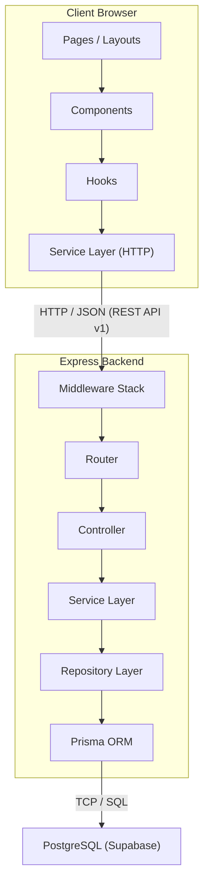
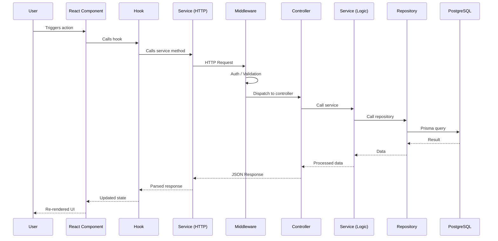

# Aether — System Architecture

## Overview

Aether is a client-server application with a strict separation between the frontend presentation layer and the backend API layer. The two communicate exclusively over HTTP via a RESTful JSON API. The database is managed entirely by the backend through an ORM layer. No frontend code ever touches the database directly.

This architecture was chosen over a monolithic full-stack framework (like Next.js API routes) for three reasons:

1. **Independent deployment** — the frontend and backend can be deployed, scaled, and versioned independently.
2. **Team scalability** — frontend and backend engineers can work in parallel without stepping on each other.
3. **API reusability** — the same backend can serve a future mobile app, CLI tool, or third-party integration without any changes.

---

## System Diagram



---

## Frontend Responsibilities

The frontend is a **presentation layer**. It is responsible for:

- Rendering the user interface using React components.
- Managing client-side state (form inputs, modals, optimistic updates).
- Calling the backend API through a typed service layer.
- Handling routing and navigation via the Next.js App Router.
- Providing a responsive, accessible, and performant user experience.

The frontend does **not**:

- Contain business logic (validation beyond basic form checks, scheduling algorithms, analytics calculations).
- Access the database.
- Manage user sessions directly (it receives tokens from the backend and stores them).

---

## Backend Responsibilities

The backend is a **logic and data layer**. It is responsible for:

- Authenticating and authorizing requests.
- Validating all incoming data (the backend never trusts the frontend).
- Executing business logic (task scheduling, plan generation, metric calculations).
- Managing database state through Prisma.
- Returning structured JSON responses with consistent error formats.

The backend does **not**:

- Render HTML or UI.
- Know anything about the frontend's component structure or routing.
- Serve static files (the frontend handles its own assets).

---

## Database Responsibilities

PostgreSQL is the single source of truth for all persistent state. It stores:

- User accounts and preferences.
- All domain entities (projects, goals, tasks, plans, sessions).
- Audit metadata (created/updated timestamps on every record).
- Soft-delete flags where data retention matters.

The database is accessed exclusively through Prisma. Raw SQL is avoided unless there is a measurable performance reason that Prisma cannot satisfy.

---

## Communication Flow

Every interaction follows this path:



### Why this many layers?

Each layer has a single reason to change:

| Layer | Changes when... |
|---|---|
| Component | The UI design changes |
| Hook | The component's data needs change |
| Service | The API contract changes |
| Controller | The HTTP interface changes |
| Service (backend) | The business rules change |
| Repository | The database schema changes |

If scheduling logic changes, only the backend service changes. The controller, repository, and frontend are untouched.

---

## Request Lifecycle

A concrete example: creating a new task.

1. User fills out a form and clicks "Create Task".
2. The React component calls `useCreateTask()` hook.
3. The hook calls `taskService.create(payload)`.
4. `taskService.create` sends `POST /api/v1/tasks` with the payload as JSON.
5. Express receives the request.
6. **CORS middleware** validates the origin.
7. **Auth middleware** extracts and validates the JWT token. Attaches `req.user`.
8. **Validation middleware** validates the request body against a Zod schema. Rejects with 400 if invalid.
9. **Router** dispatches to `TaskController.create`.
10. **Controller** extracts validated data, calls `TaskService.create(userId, data)`.
11. **Service** applies business rules (set defaults, validate project ownership, check limits).
12. **Service** calls `TaskRepository.create(data)`.
13. **Repository** calls `prisma.task.create(...)`.
14. PostgreSQL inserts the row and returns it.
15. The response flows back: Repository → Service → Controller → JSON response with 201 status.
16. Frontend service receives the response, hook updates state, component re-renders.

---

## Design Principles

### 1. Separation of Concerns

Every module, file, and function has one job. Controllers do not query the database. Services do not parse HTTP headers. Repositories do not enforce business rules.

### 2. Dependency Inversion

Higher-level modules do not depend on lower-level implementation details. Services depend on repository interfaces, not on Prisma directly. This makes testing straightforward — services can be tested with mock repositories.

### 3. Fail Fast, Fail Loud

Invalid data is rejected at the boundary (middleware validation). Errors are never silently swallowed. Every error produces a structured JSON response with a clear message and appropriate HTTP status code.

### 4. Convention Over Configuration

File naming, folder structure, and module organization follow strict conventions documented in `coding-guidelines.md`. A developer looking at any file should immediately know where to find related files.

### 5. Incremental Complexity

The architecture supports the full feature set described in the roadmap, but each version only implements what it needs. No premature abstractions. The folder structure and patterns are established now so that future versions slot into existing conventions without restructuring.

---

## API Versioning

All API routes are prefixed with `/api/v1/`. This allows breaking changes in future versions to be introduced under `/api/v2/` without disrupting existing clients.

---

## Error Response Format

Every error response follows this structure:

```json
{
  "success": false,
  "error": {
    "code": "VALIDATION_ERROR",
    "message": "Task title is required.",
    "details": [
      {
        "field": "title",
        "message": "String must contain at least 1 character."
      }
    ]
  }
}
```

Error codes are uppercase snake_case strings. The `details` array is optional and used for validation errors.

---

## Success Response Format

Every success response follows this structure:

```json
{
  "success": true,
  "data": { ... }
}
```

For paginated responses:

```json
{
  "success": true,
  "data": [ ... ],
  "pagination": {
    "page": 1,
    "pageSize": 20,
    "totalItems": 142,
    "totalPages": 8
  }
}
```

---

## Future Scalability

The current architecture is designed for a single-server deployment. When traffic demands it, the following upgrades are possible without rewriting the application:

| Concern | Current | Future |
|---|---|---|
| Frontend hosting | Local dev server | Vercel or similar edge CDN |
| Backend hosting | Single Express process | Containerized with horizontal scaling |
| Database | Supabase PostgreSQL | Supabase with read replicas or managed PostgreSQL |
| Background jobs | Inline execution | Bull/BullMQ with Redis for task scheduling and notifications |
| File storage | Local or database | S3-compatible object storage |
| Real-time updates | Polling | WebSocket or Server-Sent Events |
| Caching | None | Redis for session and query caching |

None of these upgrades require changes to the service or repository layers. They only affect infrastructure configuration and middleware.
