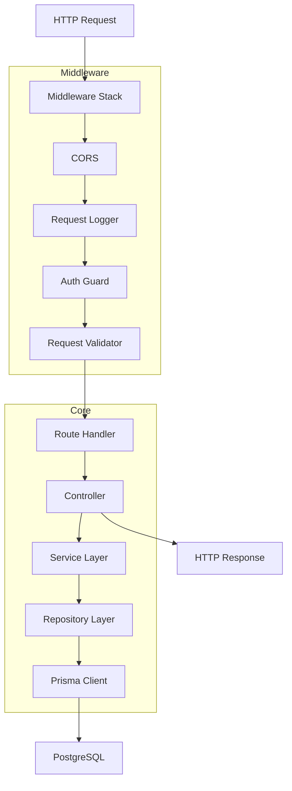
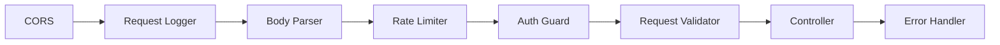
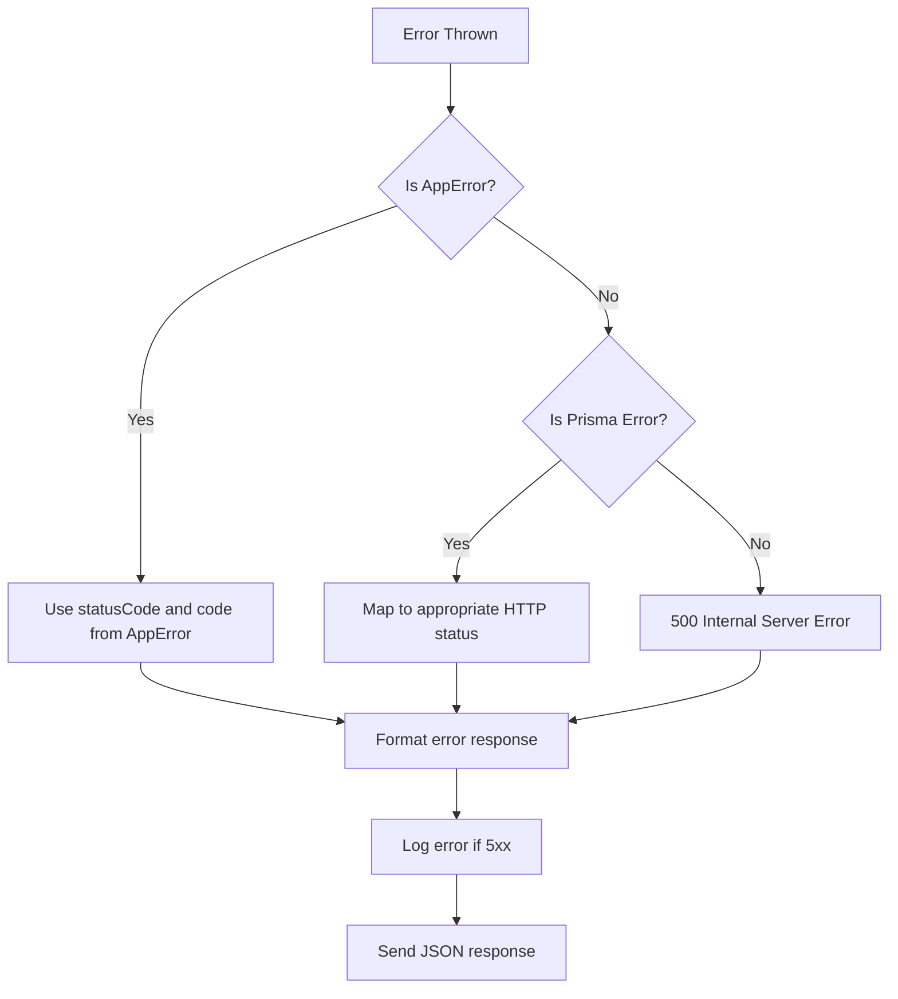
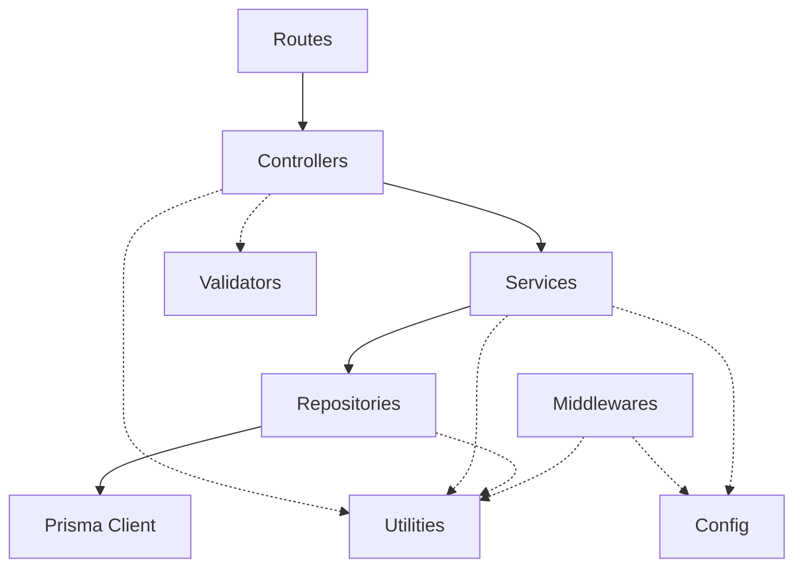

# Aether — Backend Architecture

## Overview

The backend is an Express.js application written in TypeScript. It follows a layered architecture: Routes → Middleware → Controllers → Services → Repositories → Prisma. Each layer has a single responsibility and communicates only with adjacent layers.

---

## Layer Diagram



---

## Controllers (`src/controllers/`)

Controllers are the entry point for each request after middleware processing. They:

1. Extract validated data from the request (`req.body`, `req.params`, `req.query`, `req.user`).
2. Call the appropriate service method.
3. Format and return the response.

Controllers do **not** contain business logic, database queries, or validation rules.

```
src/controllers/
├── auth.controller.ts
├── user.controller.ts
├── project.controller.ts
├── goal.controller.ts
├── task.controller.ts
├── subtask.controller.ts
├── planning.controller.ts
├── scheduling.controller.ts
├── session.controller.ts
├── analytics.controller.ts
├── notification.controller.ts
├── note.controller.ts
├── attachment.controller.ts
├── tag.controller.ts
├── settings.controller.ts
└── health.controller.ts
```

### Controller Pattern

Every controller method follows this structure:

```typescript
async function createTask(req: AuthRequest, res: Response, next: NextFunction) {
  try {
    const data = req.body;
    const userId = req.user.id;
    const task = await taskService.create(userId, data);
    sendSuccess(res, task, 201);
  } catch (error) {
    next(error);
  }
}
```

The `try/catch` with `next(error)` delegates all error handling to the centralized error handler middleware. Controllers never send error responses directly.

---

## Services (`src/services/`)

Services contain all business logic. They:

1. Enforce business rules (ownership checks, limit enforcement, status transitions).
2. Orchestrate operations that span multiple repositories.
3. Calculate derived data (goal progress, productivity metrics).
4. Trigger side effects (create notifications on task completion, update metrics).

Services do **not** know about HTTP, request objects, or response formatting.

```
src/services/
├── auth.service.ts
├── user.service.ts
├── project.service.ts
├── goal.service.ts
├── task.service.ts
├── subtask.service.ts
├── planning.service.ts
├── scheduling.service.ts
├── session.service.ts
├── analytics.service.ts
├── notification.service.ts
├── note.service.ts
├── attachment.service.ts
├── tag.service.ts
└── settings.service.ts
```

### Service Pattern

```typescript
class TaskService {
  async create(userId: string, data: CreateTaskInput): Promise<Task> {
    if (data.projectId) {
      const project = await projectRepository.findById(data.projectId);
      if (!project || project.userId !== userId) {
        throw new AppError("Project not found.", 404);
      }
    }

    const task = await taskRepository.create({ ...data, userId });

    if (data.tagIds?.length) {
      await taskTagRepository.createMany(task.id, data.tagIds);
    }

    return taskRepository.findByIdWithRelations(task.id);
  }
}
```

---

## Repositories (`src/repositories/`)

Repositories are the data access layer. They encapsulate all Prisma queries and return plain data objects. They:

1. Execute database queries (create, read, update, delete).
2. Handle pagination, sorting, and filtering.
3. Apply soft-delete filters (exclude `deletedAt IS NOT NULL` by default).

Repositories do **not** enforce business rules, check ownership, or trigger side effects.

```
src/repositories/
├── user.repository.ts
├── project.repository.ts
├── goal.repository.ts
├── task.repository.ts
├── subtask.repository.ts
├── planning.repository.ts
├── schedule-block.repository.ts
├── session.repository.ts
├── reminder.repository.ts
├── notification.repository.ts
├── note.repository.ts
├── attachment.repository.ts
├── tag.repository.ts
├── task-tag.repository.ts
├── recurring-task.repository.ts
├── productivity-metric.repository.ts
└── settings.repository.ts
```

### Repository Pattern

```typescript
class TaskRepository {
  async findByUserId(userId: string, filters: TaskFilters): Promise<PaginatedResult<Task>> {
    const where = {
      userId,
      deletedAt: null,
      ...(filters.status && { status: filters.status }),
      ...(filters.projectId && { projectId: filters.projectId }),
    };

    const [items, total] = await Promise.all([
      prisma.task.findMany({ where, skip, take, orderBy }),
      prisma.task.count({ where }),
    ]);

    return { items, total, page, pageSize };
  }
}
```

---

## Middleware (`src/middlewares/`)

Middleware functions process requests before they reach controllers.

```
src/middlewares/
├── auth.middleware.ts           → Verifies JWT, attaches req.user
├── validate.middleware.ts       → Validates req.body/params/query against Zod schemas
├── requestLogger.middleware.ts  → Logs method, path, status, duration
├── errorHandler.middleware.ts   → Catches all errors, formats error responses
├── rateLimiter.middleware.ts    → Rate limiting per user/IP
├── cors.middleware.ts           → CORS configuration
└── notFound.middleware.ts       → 404 handler for unmatched routes
```

### Middleware Execution Order



The error handler is registered last and catches any error thrown or passed via `next(error)` from any preceding layer.

---

## Routes (`src/routes/`)

Routes map HTTP methods and paths to controller functions. Each module has its own route file.

```
src/routes/
├── index.ts                    → Aggregates all route modules under /api/v1
├── auth.routes.ts
├── user.routes.ts
├── project.routes.ts
├── goal.routes.ts
├── task.routes.ts
├── planning.routes.ts
├── scheduling.routes.ts
├── session.routes.ts
├── analytics.routes.ts
├── notification.routes.ts
├── note.routes.ts
├── attachment.routes.ts
├── tag.routes.ts
├── settings.routes.ts
└── health.routes.ts
```

### Route Registration Pattern

```typescript
const router = Router();

router.get("/", authenticate, taskController.list);
router.post("/", authenticate, validate(createTaskSchema), taskController.create);
router.get("/:id", authenticate, taskController.getById);
router.patch("/:id", authenticate, validate(updateTaskSchema), taskController.update);
router.delete("/:id", authenticate, taskController.remove);

export default router;
```

The `index.ts` file mounts all modules:

```typescript
router.use("/health", healthRoutes);
router.use("/auth", authRoutes);
router.use("/users", userRoutes);
router.use("/projects", projectRoutes);
router.use("/goals", goalRoutes);
router.use("/tasks", taskRoutes);
router.use("/plans", planningRoutes);
router.use("/scheduling", schedulingRoutes);
router.use("/sessions", sessionRoutes);
router.use("/analytics", analyticsRoutes);
router.use("/notifications", notificationRoutes);
router.use("/notes", noteRoutes);
router.use("/tags", tagRoutes);
router.use("/settings", settingsRoutes);
```

---

## Validation (`src/validators/`)

Request validation uses Zod schemas. Each module has a validation file defining schemas for its endpoints.

```
src/validators/
├── auth.validator.ts
├── project.validator.ts
├── goal.validator.ts
├── task.validator.ts
├── subtask.validator.ts
├── planning.validator.ts
├── scheduling.validator.ts
├── session.validator.ts
├── note.validator.ts
├── tag.validator.ts
└── settings.validator.ts
```

### Validation Pattern

```typescript
import { z } from "zod";

export const createTaskSchema = z.object({
  body: z.object({
    title: z.string().min(1).max(200),
    description: z.string().max(5000).optional(),
    projectId: z.string().uuid().optional(),
    goalId: z.string().uuid().optional(),
    priority: z.enum(["LOW", "MEDIUM", "HIGH", "CRITICAL"]).default("MEDIUM"),
    energyLevel: z.enum(["LOW", "MEDIUM", "HIGH"]).optional(),
    estimatedMinutes: z.number().int().min(1).max(480).optional(),
    dueDate: z.string().datetime().optional(),
    tagIds: z.array(z.string().uuid()).optional(),
  }),
});
```

The `validate` middleware runs the schema against the request and attaches the parsed data back to `req.body`, `req.params`, or `req.query`.

---

## Utilities (`src/utils/`)

Pure helper functions.

```
src/utils/
├── response.ts                 → sendSuccess, sendError helper functions
├── pagination.ts               → parsePaginationParams, buildPaginationMeta
├── date.ts                     → Date manipulation, timezone conversion
├── crypto.ts                   → Token generation, hashing
├── errors.ts                   → AppError class, error code definitions
└── logger.ts                   → Structured logging utility
```

### AppError Class

```typescript
class AppError extends Error {
  constructor(
    message: string,
    public statusCode: number,
    public code: string = "INTERNAL_ERROR",
    public details?: unknown
  ) {
    super(message);
  }
}
```

All service-level errors are thrown as `AppError` instances. The error handler middleware catches them and formats the response.

---

## Configuration (`src/config/`)

Centralized configuration loaded from environment variables.

```
src/config/
├── env.ts                      → Validated environment variables (using Zod)
├── prisma.ts                   → Prisma client singleton
├── cors.ts                     → CORS options
└── index.ts                    → Re-exports all config
```

### Environment Validation

Environment variables are validated at startup using Zod. If any required variable is missing or invalid, the server refuses to start with a clear error message.

```typescript
const envSchema = z.object({
  NODE_ENV: z.enum(["development", "production", "test"]),
  PORT: z.coerce.number().default(3001),
  DATABASE_URL: z.string().url(),
  JWT_SECRET: z.string().min(32),
  GITHUB_CLIENT_ID: z.string(),
  GITHUB_CLIENT_SECRET: z.string(),
  FRONTEND_URL: z.string().url(),
});
```

---

## Logging

Logging uses a structured logger that outputs JSON in production and human-readable text in development.

Every log entry includes:
- Timestamp
- Log level (info, warn, error, debug)
- Message
- Request ID (for request-scoped logs)
- Optional metadata

```typescript
logger.info("Task created", { taskId: task.id, userId: user.id });
logger.error("Failed to create task", { error: err.message, stack: err.stack });
```

---

## Error Handling



### Prisma Error Mapping

| Prisma Code | HTTP Status | Error Code |
|---|---|---|
| P2002 | 409 | CONFLICT |
| P2025 | 404 | NOT_FOUND |
| P2003 | 400 | INVALID_REFERENCE |

---

## Environment Management

Three environments are supported:

| Environment | Purpose | Database |
|---|---|---|
| development | Local development | Local PostgreSQL or Supabase dev |
| test | Automated testing | Isolated test database |
| production | Live deployment | Supabase production |

Environment files:
- `.env` — Shared defaults (committed)
- `.env.local` — Local overrides (not committed)
- `.env.test` — Test-specific overrides (committed)

---

## Module Dependency Flow



Solid arrows show the primary data flow. Dashed arrows show utility dependencies. The key rule: dependencies flow downward only. A repository never imports from a controller. A service never imports from a route.
