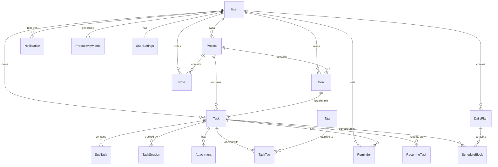

# Aether — Database Design

## Overview

Aether uses PostgreSQL as its primary data store, accessed exclusively through Prisma ORM. Every table follows these conventions:

- `id` is a UUID primary key, generated by the database.
- `createdAt` and `updatedAt` are present on every table.
- Soft deletes use a nullable `deletedAt` timestamp where data retention matters.
- All foreign keys use `ON DELETE CASCADE` unless the entity should survive its parent's deletion.
- Enum values are stored as PostgreSQL enums, not magic strings.

---

## Entity Relationship Diagram



---

## Entities

### User

**Purpose:** Represents a registered user of the platform. Every piece of data in the system belongs to a user.

| Field | Type | Notes |
|---|---|---|
| id | UUID | Primary key |
| email | String | Unique, indexed |
| name | String | Display name |
| avatarUrl | String? | Profile image URL |
| provider | Enum | Auth provider (GITHUB, GOOGLE, EMAIL) |
| providerId | String? | External provider ID |
| lastLoginAt | DateTime? | Tracks last login |
| createdAt | DateTime | Auto-set |
| updatedAt | DateTime | Auto-updated |

**Indexes:** `email` (unique), `provider + providerId` (unique compound).

**Relationships:** Has many Projects, Goals, Tasks, DailyPlans, Notes, Notifications, Reminders, ProductivityMetrics. Has one UserSettings.

**Extensibility:** Additional fields like `timezone`, `locale`, and `onboardingCompletedAt` can be added without schema changes to dependents.

---

### Project

**Purpose:** A high-level container for organizing related goals and tasks. Examples: "Semester 6 Coursework", "Startup MVP", "Fitness Journey".

| Field | Type | Notes |
|---|---|---|
| id | UUID | Primary key |
| userId | UUID | Foreign key → User |
| name | String | Project title |
| description | String? | Optional description |
| color | String | Hex color for UI identification |
| icon | String? | Icon identifier |
| status | Enum | ACTIVE, PAUSED, COMPLETED, ARCHIVED |
| sortOrder | Int | User-defined ordering |
| createdAt | DateTime | Auto-set |
| updatedAt | DateTime | Auto-updated |
| deletedAt | DateTime? | Soft delete |

**Indexes:** `userId + status` (composite for filtered queries), `userId + sortOrder`.

**Relationships:** Belongs to User. Has many Goals, Tasks, Notes.

**Extensibility:** Future versions can add `deadline`, `budget`, `collaborators` (for shared projects), and `templateId` (for project templates).

---

### Goal

**Purpose:** A measurable objective within a project. Goals break down into tasks. Examples: "Complete Data Structures module", "Launch landing page".

| Field | Type | Notes |
|---|---|---|
| id | UUID | Primary key |
| userId | UUID | Foreign key → User |
| projectId | UUID? | Foreign key → Project (optional, goals can be standalone) |
| title | String | Goal title |
| description | String? | Optional description |
| status | Enum | NOT_STARTED, IN_PROGRESS, COMPLETED, ABANDONED |
| priority | Enum | LOW, MEDIUM, HIGH, CRITICAL |
| targetDate | DateTime? | Optional deadline |
| completedAt | DateTime? | When the goal was marked complete |
| progress | Int | 0-100 percentage, calculated from child tasks |
| sortOrder | Int | User-defined ordering |
| createdAt | DateTime | Auto-set |
| updatedAt | DateTime | Auto-updated |
| deletedAt | DateTime? | Soft delete |

**Indexes:** `userId + status`, `projectId`, `userId + targetDate`.

**Relationships:** Belongs to User, optionally belongs to Project. Has many Tasks.

**Extensibility:** Future versions can add `milestones` as sub-goals, `keyResults` for OKR-style tracking, and `linkedGoalId` for goal dependencies.

---

### Task

**Purpose:** The core unit of work. Tasks are what users actually execute during their day. Every task belongs to a user and optionally to a project and/or goal.

| Field | Type | Notes |
|---|---|---|
| id | UUID | Primary key |
| userId | UUID | Foreign key → User |
| projectId | UUID? | Foreign key → Project |
| goalId | UUID? | Foreign key → Goal |
| title | String | Task title |
| description | String? | Rich text description |
| status | Enum | TODO, IN_PROGRESS, COMPLETED, CANCELLED |
| priority | Enum | LOW, MEDIUM, HIGH, CRITICAL |
| energyLevel | Enum? | LOW, MEDIUM, HIGH (how much energy this task requires) |
| estimatedMinutes | Int? | Estimated time to complete |
| actualMinutes | Int? | Actual time spent (aggregated from sessions) |
| dueDate | DateTime? | Optional deadline |
| completedAt | DateTime? | When the task was marked complete |
| sortOrder | Int | User-defined ordering within its context |
| createdAt | DateTime | Auto-set |
| updatedAt | DateTime | Auto-updated |
| deletedAt | DateTime? | Soft delete |

**Indexes:** `userId + status`, `userId + dueDate`, `projectId + status`, `goalId`, `userId + priority + status`.

**Relationships:** Belongs to User, optionally to Project and Goal. Has many SubTasks, TaskSessions, Attachments, TaskTags, Reminders, RecurringTasks, ScheduleBlocks.

**Why `energyLevel`?** The smart scheduling engine uses this to match tasks to time slots based on the user's energy curve throughout the day.

**Extensibility:** Future additions include `blockedByTaskId` for dependencies, `delegatedToUserId` for team features, and `externalUrl` for linking to external tools.

---

### SubTask

**Purpose:** A checklist item within a task. SubTasks are simple boolean items that help break a task into smaller steps.

| Field | Type | Notes |
|---|---|---|
| id | UUID | Primary key |
| taskId | UUID | Foreign key → Task |
| title | String | SubTask title |
| isCompleted | Boolean | Default false |
| sortOrder | Int | Ordering within the task |
| completedAt | DateTime? | When checked off |
| createdAt | DateTime | Auto-set |
| updatedAt | DateTime | Auto-updated |

**Indexes:** `taskId + sortOrder`.

**Relationships:** Belongs to Task.

**Extensibility:** Future versions can add `assigneeId` for team task breakdown.

---

### ScheduleBlock

**Purpose:** A time-boxed slot in a daily plan. Each block represents a task assigned to a specific time window during the day.

| Field | Type | Notes |
|---|---|---|
| id | UUID | Primary key |
| dailyPlanId | UUID | Foreign key → DailyPlan |
| taskId | UUID | Foreign key → Task |
| startTime | DateTime | Block start time |
| endTime | DateTime | Block end time |
| status | Enum | SCHEDULED, IN_PROGRESS, COMPLETED, SKIPPED, RESCHEDULED |
| sortOrder | Int | Visual ordering for the day |
| createdAt | DateTime | Auto-set |
| updatedAt | DateTime | Auto-updated |

**Indexes:** `dailyPlanId + sortOrder`, `taskId`, `dailyPlanId + startTime`.

**Relationships:** Belongs to DailyPlan and Task.

**Why not just use `dueDate` on Task?** A task's due date is when it needs to be done by. A schedule block is when the user plans to work on it. A single task might appear in multiple daily plans if it spans several days.

**Extensibility:** Future versions can add `isAutoScheduled` flag, `bufferMinutes` for break time, and `actualStartTime` / `actualEndTime` for tracking adherence.

---

### DailyPlan

**Purpose:** Represents a user's plan for a specific date. Contains schedule blocks that map tasks to time slots.

| Field | Type | Notes |
|---|---|---|
| id | UUID | Primary key |
| userId | UUID | Foreign key → User |
| date | Date | The date this plan is for (unique per user) |
| status | Enum | DRAFT, ACTIVE, COMPLETED, ABANDONED |
| reflection | String? | End-of-day reflection note |
| energyCurve | Json? | User's expected energy levels throughout the day |
| createdAt | DateTime | Auto-set |
| updatedAt | DateTime | Auto-updated |

**Indexes:** `userId + date` (unique compound), `userId + status`.

**Relationships:** Belongs to User. Has many ScheduleBlocks.

**Why `energyCurve` is JSON?** Energy patterns vary per user and per day. Storing it as a structured JSON array `[{ hour: 9, level: "HIGH" }, ...]` is more flexible than a rigid column-per-hour approach.

**Extensibility:** Future versions can add `mood`, `dailyGoal`, `templateId` for reusable plan templates.

---

### TaskSession

**Purpose:** A recorded work session on a specific task. Powers the focus timer feature and feeds into productivity analytics.

| Field | Type | Notes |
|---|---|---|
| id | UUID | Primary key |
| taskId | UUID | Foreign key → Task |
| userId | UUID | Foreign key → User |
| startedAt | DateTime | Session start |
| endedAt | DateTime? | Session end (null if ongoing) |
| durationMinutes | Int? | Calculated duration |
| sessionType | Enum | FOCUS, BREAK, POMODORO |
| notes | String? | Session notes |
| interruptions | Int | Default 0, count of interruptions |
| createdAt | DateTime | Auto-set |

**Indexes:** `taskId`, `userId + startedAt`, `userId + sessionType`.

**Relationships:** Belongs to Task and User.

**Extensibility:** Future versions can add `qualityRating` (self-assessed focus quality), `environmentTags` (home, office, cafe), and `linkedScheduleBlockId`.

---

### Reminder

**Purpose:** A time-based notification trigger for a task.

| Field | Type | Notes |
|---|---|---|
| id | UUID | Primary key |
| taskId | UUID | Foreign key → Task |
| userId | UUID | Foreign key → User |
| remindAt | DateTime | When to fire the reminder |
| type | Enum | BEFORE_DUE, CUSTOM, RECURRING |
| offsetMinutes | Int? | Minutes before due date (for BEFORE_DUE type) |
| isSent | Boolean | Default false |
| sentAt | DateTime? | When actually sent |
| createdAt | DateTime | Auto-set |
| updatedAt | DateTime | Auto-updated |

**Indexes:** `userId + isSent + remindAt` (for querying unsent reminders), `taskId`.

**Relationships:** Belongs to Task and User.

**Extensibility:** Future versions can add `channel` (EMAIL, PUSH, IN_APP), `snoozeCount`, `recurringCron`.

---

### Notification

**Purpose:** An in-app notification delivered to the user. Generated by reminders, system events, or other triggers.

| Field | Type | Notes |
|---|---|---|
| id | UUID | Primary key |
| userId | UUID | Foreign key → User |
| type | Enum | REMINDER, SYSTEM, ACHIEVEMENT, PLANNING_PROMPT |
| title | String | Notification title |
| body | String | Notification body |
| isRead | Boolean | Default false |
| readAt | DateTime? | When marked as read |
| actionUrl | String? | Deep link into the app |
| metadata | Json? | Additional data for rendering |
| createdAt | DateTime | Auto-set |

**Indexes:** `userId + isRead + createdAt` (for unread notifications feed), `userId + type`.

**Relationships:** Belongs to User.

**Extensibility:** Future versions can add `expiresAt` for auto-dismissal, `priority` for notification ranking, and `groupKey` for collapsing related notifications.

---

### Note

**Purpose:** A freeform text note attached to a project, task, or standalone. Supports rich text content.

| Field | Type | Notes |
|---|---|---|
| id | UUID | Primary key |
| userId | UUID | Foreign key → User |
| projectId | UUID? | Foreign key → Project (optional) |
| taskId | UUID? | Foreign key → Task (optional) |
| title | String | Note title |
| content | String | Rich text content (stored as HTML or Markdown) |
| isPinned | Boolean | Default false |
| createdAt | DateTime | Auto-set |
| updatedAt | DateTime | Auto-updated |
| deletedAt | DateTime? | Soft delete |

**Indexes:** `userId + isPinned`, `projectId`, `taskId`.

**Relationships:** Belongs to User, optionally to Project or Task.

**Extensibility:** Future versions can add `contentFormat` (MARKDOWN, HTML, PLAIN), full-text search indexing, and `sharedWithUserIds`.

---

### Attachment

**Purpose:** A file attached to a task. Stores metadata about the file; actual file storage is handled externally.

| Field | Type | Notes |
|---|---|---|
| id | UUID | Primary key |
| taskId | UUID | Foreign key → Task |
| userId | UUID | Foreign key → User |
| fileName | String | Original file name |
| fileUrl | String | URL to the stored file |
| fileSize | Int | Size in bytes |
| mimeType | String | MIME type |
| createdAt | DateTime | Auto-set |

**Indexes:** `taskId`, `userId`.

**Relationships:** Belongs to Task and User.

**Extensibility:** Future versions can add `thumbnailUrl`, `virusScanStatus`, and support for attaching files to Notes and Projects.

---

### Tag

**Purpose:** A user-defined label for categorizing tasks. Examples: "urgent", "deep-work", "meeting", "reading".

| Field | Type | Notes |
|---|---|---|
| id | UUID | Primary key |
| userId | UUID | Foreign key → User |
| name | String | Tag name |
| color | String | Hex color for UI display |
| createdAt | DateTime | Auto-set |

**Indexes:** `userId + name` (unique compound).

**Relationships:** Belongs to User. Has many TaskTags.

**Extensibility:** Future versions can add `icon`, `description`, and tag grouping.

---

### TaskTag

**Purpose:** Junction table implementing the many-to-many relationship between Tasks and Tags.

| Field | Type | Notes |
|---|---|---|
| id | UUID | Primary key |
| taskId | UUID | Foreign key → Task |
| tagId | UUID | Foreign key → Tag |
| createdAt | DateTime | Auto-set |

**Indexes:** `taskId + tagId` (unique compound).

**Relationships:** Belongs to Task and Tag.

---

### RecurringTask

**Purpose:** Defines a recurrence pattern for a task. When a recurring task fires, the system creates a new Task instance from the template.

| Field | Type | Notes |
|---|---|---|
| id | UUID | Primary key |
| taskId | UUID | Foreign key → Task (the template task) |
| userId | UUID | Foreign key → User |
| pattern | Enum | DAILY, WEEKDAYS, WEEKLY, BIWEEKLY, MONTHLY, CUSTOM |
| cronExpression | String? | For CUSTOM pattern |
| startDate | Date | When recurrence begins |
| endDate | Date? | When recurrence ends (null = forever) |
| nextOccurrence | Date | Next scheduled creation date |
| isActive | Boolean | Default true |
| createdAt | DateTime | Auto-set |
| updatedAt | DateTime | Auto-updated |

**Indexes:** `userId + isActive + nextOccurrence` (for the recurrence job), `taskId`.

**Relationships:** Belongs to Task and User.

**Extensibility:** Future versions can add `maxOccurrences`, `skipDates` (JSON array of dates to skip), and `adjustForHolidays`.

---

### ProductivityMetric

**Purpose:** Stores aggregated productivity data for a user on a given date. Pre-calculated to avoid expensive queries on the analytics dashboard.

| Field | Type | Notes |
|---|---|---|
| id | UUID | Primary key |
| userId | UUID | Foreign key → User |
| date | Date | The date this metric covers |
| tasksCreated | Int | Tasks created on this date |
| tasksCompleted | Int | Tasks completed on this date |
| totalFocusMinutes | Int | Total focus session time |
| totalSessions | Int | Number of focus sessions |
| planAdherence | Float? | Percentage of planned blocks completed (0.0 - 1.0) |
| streak | Int | Current consecutive days with at least one completed task |
| createdAt | DateTime | Auto-set |
| updatedAt | DateTime | Auto-updated |

**Indexes:** `userId + date` (unique compound), `userId + streak`.

**Relationships:** Belongs to User.

**Why pre-calculate?** Running `COUNT` and `SUM` queries across tasks, sessions, and plans on every dashboard load does not scale. Metrics are calculated once at end-of-day (or on-demand) and cached in this table.

**Extensibility:** Future versions can add `goalProgress`, `topTags` (JSON), `averageSessionLength`, and `comparisonToPrevious` (week-over-week change).

---

### UserSettings

**Purpose:** Stores user preferences and configuration. One row per user.

| Field | Type | Notes |
|---|---|---|
| id | UUID | Primary key |
| userId | UUID | Foreign key → User (unique) |
| theme | Enum | DARK, LIGHT, SYSTEM |
| timezone | String | IANA timezone (e.g. "Asia/Kolkata") |
| defaultPlanStartTime | String | Default day start time (e.g. "09:00") |
| defaultPlanEndTime | String | Default day end time (e.g. "22:00") |
| pomodoroWorkMinutes | Int | Default 25 |
| pomodoroBreakMinutes | Int | Default 5 |
| pomodoroLongBreakMinutes | Int | Default 15 |
| weekStartsOn | Enum | SUNDAY, MONDAY |
| emailNotifications | Boolean | Default true |
| pushNotifications | Boolean | Default false |
| dailyPlanningReminder | Boolean | Default true |
| dailyReviewReminder | Boolean | Default true |
| createdAt | DateTime | Auto-set |
| updatedAt | DateTime | Auto-updated |

**Indexes:** `userId` (unique).

**Relationships:** Belongs to User (one-to-one).

**Extensibility:** Future versions can add `language`, `dateFormat`, `soundEnabled`, `focusModePreferences` (JSON).

---

## Enum Definitions

```
ProjectStatus: ACTIVE, PAUSED, COMPLETED, ARCHIVED
GoalStatus: NOT_STARTED, IN_PROGRESS, COMPLETED, ABANDONED
TaskStatus: TODO, IN_PROGRESS, COMPLETED, CANCELLED
Priority: LOW, MEDIUM, HIGH, CRITICAL
EnergyLevel: LOW, MEDIUM, HIGH
ScheduleBlockStatus: SCHEDULED, IN_PROGRESS, COMPLETED, SKIPPED, RESCHEDULED
DailyPlanStatus: DRAFT, ACTIVE, COMPLETED, ABANDONED
SessionType: FOCUS, BREAK, POMODORO
ReminderType: BEFORE_DUE, CUSTOM, RECURRING
NotificationType: REMINDER, SYSTEM, ACHIEVEMENT, PLANNING_PROMPT
RecurrencePattern: DAILY, WEEKDAYS, WEEKLY, BIWEEKLY, MONTHLY, CUSTOM
Theme: DARK, LIGHT, SYSTEM
WeekStart: SUNDAY, MONDAY
AuthProvider: GITHUB, GOOGLE, EMAIL
```

---

## Indexing Strategy

Indexes are designed around the most common query patterns:

1. **User-scoped queries** — Almost every query filters by `userId` first. Every table with a `userId` foreign key has a composite index starting with `userId`.
2. **Status filtering** — Dashboards filter by status (active tasks, completed goals). Composite indexes like `userId + status` serve these.
3. **Date range queries** — Analytics, planning, and scheduling query by date ranges. Indexes on date columns are combined with `userId`.
4. **Sorting** — `sortOrder` is indexed for drag-and-drop reordering queries.

Indexes are not added speculatively. They are added when a query pattern is implemented and measured.

---

## Migration Strategy

Prisma Migrate manages all schema changes. The workflow:

1. Modify `schema.prisma`.
2. Run `npx prisma migrate dev --name descriptive_name`.
3. Review the generated SQL migration.
4. Commit both the schema and migration files.

Migrations are never edited after they have been applied to a shared environment. Breaking changes are handled by creating new migrations that transform data.
