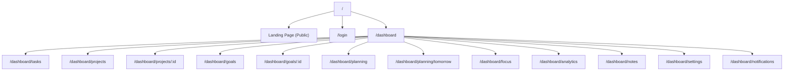
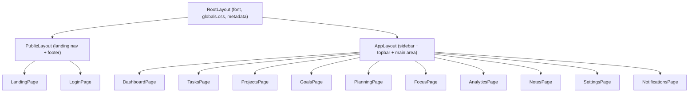
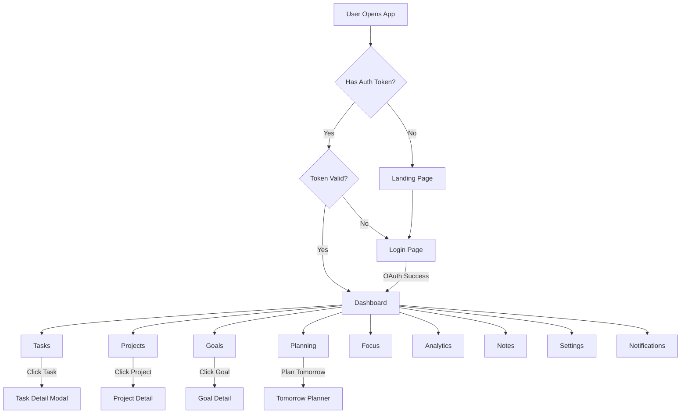

# Aether — Frontend Architecture

## Overview

The frontend is a Next.js 16 application using the App Router, React 19, TypeScript, and Tailwind CSS v4. It is a presentation layer that communicates with the backend API over HTTP. It contains no business logic, no database access, and no authentication token generation.

---

## Routing



### Route Groups

| Group | Purpose |
|---|---|
| `(public)` | Landing page and login. No authentication required. No dashboard layout. |
| `(app)` | All authenticated pages. Uses the dashboard layout with sidebar and navbar. |

---

## Layouts



| Layout | Responsibility |
|---|---|
| RootLayout | Loads fonts, global styles, metadata. Wraps the entire app. |
| PublicLayout | Renders the landing page navbar and footer. No sidebar. |
| AppLayout | Renders the authenticated dashboard shell: collapsible sidebar, top bar with user menu, and the scrollable main content area. Handles auth redirection. |

---

## Page Hierarchy

```
src/app/
├── layout.tsx                  → RootLayout
├── page.tsx                    → Landing page
├── login/
│   └── page.tsx                → Login page
├── (app)/
│   ├── layout.tsx              → AppLayout (sidebar + topbar)
│   ├── dashboard/
│   │   └── page.tsx            → Dashboard overview
│   ├── tasks/
│   │   └── page.tsx            → Task list and management
│   ├── projects/
│   │   ├── page.tsx            → Project list
│   │   └── [id]/
│   │       └── page.tsx        → Single project view
│   ├── goals/
│   │   ├── page.tsx            → Goal list
│   │   └── [id]/
│   │       └── page.tsx        → Single goal view
│   ├── planning/
│   │   ├── page.tsx            → Today's plan
│   │   └── tomorrow/
│   │       └── page.tsx        → Tomorrow planner
│   ├── focus/
│   │   └── page.tsx            → Focus session timer
│   ├── analytics/
│   │   └── page.tsx            → Productivity analytics
│   ├── notes/
│   │   └── page.tsx            → Notes list and editor
│   ├── settings/
│   │   └── page.tsx            → User settings
│   └── notifications/
│       └── page.tsx            → Notification center
```

---

## Component Organization

### Shared Components (`src/components/`)

These are reusable components used across multiple pages.

```
src/components/
├── ui/                         → Primitive UI components
│   ├── Button.tsx
│   ├── Input.tsx
│   ├── Select.tsx
│   ├── Textarea.tsx
│   ├── Modal.tsx
│   ├── Dialog.tsx
│   ├── Dropdown.tsx
│   ├── Badge.tsx
│   ├── Avatar.tsx
│   ├── Tooltip.tsx
│   ├── Spinner.tsx
│   ├── Skeleton.tsx
│   ├── EmptyState.tsx
│   ├── Card.tsx
│   └── ProgressBar.tsx
├── layout/
│   ├── Navbar.tsx              → Public landing navbar
│   ├── Footer.tsx              → Public landing footer
│   ├── Sidebar.tsx             → Dashboard sidebar
│   ├── Topbar.tsx              → Dashboard top bar
│   └── MobileNav.tsx           → Responsive mobile navigation
├── forms/
│   ├── TaskForm.tsx
│   ├── ProjectForm.tsx
│   ├── GoalForm.tsx
│   ├── NoteEditor.tsx
│   └── SettingsForm.tsx
├── data-display/
│   ├── TaskCard.tsx
│   ├── TaskList.tsx
│   ├── ProjectCard.tsx
│   ├── GoalCard.tsx
│   ├── ScheduleTimeline.tsx
│   ├── NotificationItem.tsx
│   ├── StatCard.tsx
│   └── Chart.tsx
└── feedback/
    ├── Toast.tsx
    ├── ConfirmDialog.tsx
    └── ErrorBoundary.tsx
```

### Component Design Rules

1. Every component is a named export.
2. Components accept props through a typed interface defined in the same file.
3. Components do not fetch data. They receive data through props or hooks.
4. Components that need client interactivity start with `"use client"`.
5. Server Components are the default. Only opt into Client Components when needed.

---

## Hooks (`src/hooks/`)

Custom hooks encapsulate reusable stateful logic. They sit between components and services.

```
src/hooks/
├── useAuth.ts                  → Authentication state and methods
├── useTasks.ts                 → CRUD operations for tasks
├── useProjects.ts              → CRUD operations for projects
├── useGoals.ts                 → CRUD operations for goals
├── usePlanning.ts              → Daily plan operations
├── useSessions.ts              → Focus session start/stop
├── useAnalytics.ts             → Analytics data fetching
├── useNotes.ts                 → Note CRUD
├── useNotifications.ts         → Notification fetching and marking
├── useSettings.ts              → User settings management
├── useTags.ts                  → Tag CRUD
├── useDebounce.ts              → Debounced value utility
├── useLocalStorage.ts          → Typed localStorage wrapper
└── useMediaQuery.ts            → Responsive breakpoint detection
```

### Hook Pattern

Every data-fetching hook follows the same pattern:

```typescript
function useTasks(filters?: TaskFilters) {
  // Fetches data via the service layer
  // Returns { data, isLoading, error, mutate }
  // Handles optimistic updates where appropriate
}
```

---

## Services (`src/services/`)

Services are the HTTP client layer. Each service maps to a backend API module and exposes typed methods.

```
src/services/
├── api.ts                      → Base HTTP client (fetch wrapper with auth headers)
├── auth.service.ts
├── user.service.ts
├── project.service.ts
├── goal.service.ts
├── task.service.ts
├── planning.service.ts
├── scheduling.service.ts
├── session.service.ts
├── analytics.service.ts
├── notification.service.ts
├── note.service.ts
├── attachment.service.ts
├── tag.service.ts
└── settings.service.ts
```

### Base API Client

The `api.ts` module provides a thin wrapper around `fetch` that:

- Prepends the `NEXT_PUBLIC_API_URL` base URL.
- Attaches the `Authorization` header from stored tokens.
- Parses JSON responses.
- Throws typed errors for non-2xx responses.

---

## Types (`src/types/`)

All TypeScript types and interfaces are organized by domain.

```
src/types/
├── user.ts
├── project.ts
├── goal.ts
├── task.ts
├── planning.ts
├── session.ts
├── analytics.ts
├── notification.ts
├── note.ts
├── attachment.ts
├── tag.ts
├── settings.ts
├── api.ts                      → API response envelope types
└── enums.ts                    → Shared enum definitions
```

Types are shared between hooks, services, and components. They mirror the backend API response shapes.

---

## Utilities (`src/utils/`)

Pure helper functions with no side effects.

```
src/utils/
├── date.ts                     → Date formatting, relative time, timezone helpers
├── format.ts                   → Number formatting, truncation, pluralization
├── validation.ts               → Client-side form validation helpers
├── cn.ts                       → Tailwind class merging utility
└── constants.ts                → App-wide constants (routes, defaults, limits)
```

---

## State Management

Aether uses a lightweight state management approach:

| Layer | Tool | Purpose |
|---|---|---|
| Server state | SWR or React Query | Caching, revalidation, and synchronization of API data |
| Form state | React Hook Form | Form input management and client-side validation |
| UI state | React useState/useReducer | Modals, dropdowns, sidebar toggle |
| Global state | React Context | Auth state, theme, user settings |

No Redux. No Zustand. The combination of a data-fetching library and React Context covers all needs without adding complexity.

### Context Providers

```
src/context/
├── AuthContext.tsx              → Stores auth token, user object, login/logout methods
├── ThemeContext.tsx             → Theme preference (respects UserSettings)
└── SidebarContext.tsx           → Sidebar collapsed/expanded state
```

---

## Navigation Flow



---

## Future Scalability

| Concern | Approach |
|---|---|
| More pages | Add new routes under `(app)/`. The layout system handles the shell automatically. |
| More components | Add to the appropriate subfolder in `components/`. The categorization (ui, forms, data-display, feedback) scales indefinitely. |
| Real-time updates | Add a WebSocket service in `services/` and a `useRealtime` hook. Components subscribe via the hook. |
| Offline support | Add a service worker and cache API responses in IndexedDB. The service layer abstracts this from components. |
| Mobile app | The service layer can be extracted into a shared package and reused in a React Native app. |
| i18n | Add a `messages/` folder with JSON translation files and an `i18n.ts` utility. Components use a `useTranslation` hook. |
