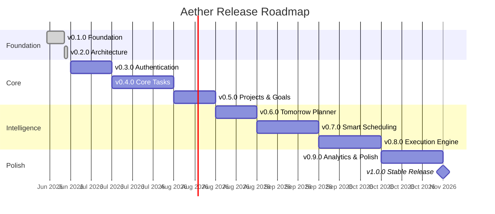

# Aether — Roadmap

## Version Timeline

---

## v0.1.0 — Foundation ✅

**Status:** Complete

**What it delivered:**

- Monorepo structure with independent `frontend/` and `backend/` projects.
- Next.js 16 frontend with Tailwind CSS v4, App Router, and TypeScript.
- Express backend with TypeScript, Prisma ORM, and Supabase PostgreSQL.
- Landing page with hero section, features, and call-to-action.
- Dashboard shell with sidebar, stat cards, and placeholder content.
- Backend health check endpoint (`GET /api/v1/health`).
- Environment configuration with `.env.example` files.
- Git repository with conventional commit history.

**Why this came first:** Nothing can be built without a working foundation. This version established the project structure, tooling, and deployment pipeline that every future version builds on.

---

## v0.2.0 — Architecture ✅

**Status:** Complete

**What it delivered:**

- Complete system architecture documentation.
- Database design for all 17 entities with an ER diagram.
- Full API specification for all modules and endpoints.
- Frontend architecture (routing, components, hooks, services, state management).
- Backend architecture (controllers, services, repositories, middleware, validation).
- Folder structure documentation for both frontend and backend.
- Coding guidelines (naming, git, comments, error handling, formatting).
- Design system (colors, typography, spacing, animations, accessibility).
- This roadmap.

**Why this came before code:** Professional software is designed before it is built. Writing architecture documentation forces decisions about data models, API contracts, and component boundaries before a single line of feature code is written. This prevents the "refactor everything after v0.4.0" problem that kills hobby projects.

---

## v0.3.0 — Authentication

**Status:** Planned

**What it will deliver:**

- GitHub OAuth login flow (frontend and backend).
- JWT token generation, validation, and refresh.
- Auth middleware protecting all authenticated routes.
- `User` and `UserSettings` Prisma models and migrations.
- User profile page (view and edit).
- Login/logout UI flow.
- Auth context provider on the frontend.
- Protected route handling (redirect to login if unauthenticated).
- Session persistence across browser refreshes.

**Technical decisions:**

- JWT access tokens (short-lived, 15 minutes) with refresh tokens (long-lived, 7 days).
- GitHub as the only OAuth provider initially. Google and email/password can be added later.
- The `User` model stores the provider and provider ID, making it extensible to multiple auth providers.

**Why authentication is the first feature:** Every subsequent feature is user-scoped. Tasks belong to users. Plans belong to users. Settings belong to users. Building auth first means every feature after this can be developed with real user context.

---

## v0.4.0 — Core Tasks

**Status:** Planned

**What it will deliver:**

- `Task`, `SubTask`, `Tag`, and `TaskTag` Prisma models and migrations.
- Full CRUD API for tasks, subtasks, and tags.
- Task list page with filtering (status, priority, due date, tags).
- Task creation form with all fields.
- Task detail view with subtask checklist.
- Inline task status updates (checkbox toggle).
- Drag-and-drop reordering.
- Tag management (create, edit, delete, assign to tasks).
- Task search.

**Technical decisions:**

- Tasks are the atomic unit of work in Aether. Every other feature (planning, scheduling, focus, analytics) operates on tasks. Getting the task model right is critical.
- Subtasks are simple boolean checklists, not recursive tasks. This keeps the data model flat and queries fast.
- Soft deletes for tasks. Users can recover deleted tasks within a future "trash" feature.

**Why tasks before projects:** Tasks can exist without projects. Projects cannot be useful without tasks. Building tasks first allows testing the entire vertical (API → service → repository → UI) before adding the project abstraction layer.

---

## v0.5.0 — Projects & Goals

**Status:** Planned

**What it will deliver:**

- `Project` and `Goal` Prisma models and migrations.
- Full CRUD API for projects and goals.
- Project list page with status filtering and color coding.
- Project detail page showing goals and tasks.
- Goal list page with progress tracking.
- Goal detail page showing child tasks and completion percentage.
- Ability to assign tasks to projects and goals.
- Project and goal archiving.

**Technical decisions:**

- Projects are organizational containers. They have a color and optional icon for visual identification in the sidebar.
- Goals have a `progress` field that is recalculated whenever a child task's status changes. This is a service-level side effect, not a database trigger.
- Tasks can optionally belong to a project and/or goal. Standalone tasks (no project, no goal) are explicitly supported.

---

## v0.6.0 — Tomorrow Planner

**Status:** Planned

**What it will deliver:**

- `DailyPlan` and `ScheduleBlock` Prisma models and migrations.
- Daily plan API (create, view, update).
- Schedule block API (add, remove, reorder, update status).
- "Today" view showing the current day's plan as a timeline.
- "Tomorrow Planner" page for creating the next day's plan.
- Drag tasks from a sidebar into time slots.
- Plan status tracking (draft → active → completed).
- End-of-day reflection field.

**Technical decisions:**

- Each day has at most one plan per user (enforced by unique constraint on `userId + date`).
- Schedule blocks are time-boxed slots. They reference tasks but do not modify them. A task can appear in multiple daily plans.
- The Tomorrow Planner is separate from Today's view. Planning is a deliberate act, not an afterthought.

**Why tomorrow planner before smart scheduling:** Manual planning must work before automation can improve it. Users need to understand how planning works and what a good plan looks like before the system can suggest plans for them.

---

## v0.7.0 — Smart Scheduling

**Status:** Planned

**What it will deliver:**

- Auto-scheduling API that generates suggested schedule blocks.
- Scheduling algorithm that considers task priority, energy level, estimated duration, and due dates.
- User energy curve preferences (which hours are high/medium/low energy).
- "Auto-fill" button on the planner that generates a suggested plan.
- Ability to accept, reject, or modify individual suggestions.
- `RecurringTask` model and automatic task generation.

**Technical decisions:**

- The scheduling algorithm runs server-side. It receives the user's available time slots, unscheduled tasks, and energy preferences, then returns a sorted assignment.
- High-energy tasks are matched to high-energy time slots. This is the core innovation of Aether's planning system.
- Recurring tasks generate new task instances on their `nextOccurrence` date. The original task serves as a template.

---

## v0.8.0 — Execution Engine

**Status:** Planned

**What it will deliver:**

- `TaskSession` model and focus timer API.
- Focus session timer with start/stop/pause.
- Pomodoro mode (configurable work/break intervals from UserSettings).
- Session history for each task.
- `actualMinutes` calculation on tasks from session data.
- `Reminder` and `Notification` models and APIs.
- In-app notification center.
- Reminder creation and delivery system.

**Technical decisions:**

- Focus sessions are tracked as individual records, not as a running timer in the database. The frontend maintains the timer UI; the backend records the session when it ends.
- Notifications are stored in the database and fetched via polling initially. WebSockets can be added later without changing the data model.
- Reminders are processed by a background job that checks for upcoming reminders periodically.

---

## v0.9.0 — Analytics & Production Polish

**Status:** Planned

**What it will deliver:**

- `ProductivityMetric` model and analytics API.
- Dashboard analytics with charts (tasks completed, focus time, streaks).
- Weekly and monthly trend analysis.
- Plan adherence tracking.
- `Note` and `Attachment` models and APIs.
- Notes page with rich text editor.
- File attachment support on tasks.
- Performance optimization (query analysis, caching).
- Error boundary improvements.
- Loading states and skeleton screens across all pages.
- Mobile responsive polish.

**Technical decisions:**

- Productivity metrics are pre-calculated and stored per-user-per-day. This avoids expensive aggregation queries on every dashboard load.
- Charts use a lightweight library (e.g., Recharts or Chart.js) that renders client-side.
- Attachments store metadata in the database and files in an external storage service. The initial implementation can use local storage or Supabase Storage.

---

## v1.0.0 — Stable Release

**Status:** Planned

**What it will deliver:**

- Light theme support.
- Onboarding flow for new users.
- Data export (tasks, plans, analytics as CSV/JSON).
- Keyboard shortcuts across the application.
- Full accessibility audit and remediation.
- Performance profiling and optimization.
- Comprehensive error handling and edge case coverage.
- Final documentation review.
- Production deployment configuration.

**What v1.0.0 means:** The application is feature-complete for its initial scope, stable enough for daily use, and polished enough to share publicly. It is not "done" — it is the foundation for v1.x improvements and v2.0 ambitions.

---

## Beyond v1.0.0

Future possibilities (not committed):

- **Team collaboration** — Shared projects, task delegation, team analytics.
- **Calendar integration** — Sync with Google Calendar and Outlook.
- **Mobile app** — React Native app sharing the service layer with the web frontend.
- **AI planning assistant** — Natural language task creation and intelligent plan suggestions.
- **Plugin system** — Third-party integrations (Todoist import, GitHub issue sync, Slack notifications).
- **API for developers** — Public API with OAuth for third-party apps.
